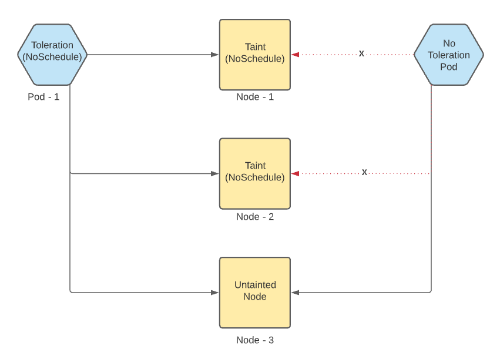

- [Certified Kubernetes Administrator Exam Notes](#certified-kubernetes-administrator-exam-notes)
  - [4.0 Understanding API Access and Commands](#40-understanding-api-access-and-commands)
    - [4.2 Core Kubernetes objects](#42-core-kubernetes-objects)
    - [4.3 Options to explore the API](#43-options-to-explore-the-api)
      - [Interacting with the API](#interacting-with-the-api)
    - [4.4 Kubectl to Manage API objects.](#44-kubectl-to-manage-api-objects)
    - [4.5 Using YAML files to define API Objects.](#45-using-yaml-files-to-define-api-objects)
    - [4.6 Using Curl to work with API Objects](#46-using-curl-to-work-with-api-objects)
    - [4.6 Understanding other commands](#46-understanding-other-commands)
  - [5.0 Running pods with deployments.](#50-running-pods-with-deployments)
    - [5.1 Understanding Namespaces](#51-understanding-namespaces)
    - [5.2 Managing Pods and Deployments](#52-managing-pods-and-deployments)
    - [5.3 Running Pods by deployments](#53-running-pods-by-deployments)
    - [5.4 Understanding labels and annotations](#54-understanding-labels-and-annotations)
    - [5.5 Managing Rolling updates.](#55-managing-rolling-updates)
    - [5.6 Managing Deployment History](#56-managing-deployment-history)
    - [5.7 Using init containers.](#57-using-init-containers)
    - [5.8 Managing Stateful sets.](#58-managing-stateful-sets)
    - [5.9 Using DaemonSets](#59-using-daemonsets)
  - [6.0 Understanding Kubernetes Storage Options](#60-understanding-kubernetes-storage-options)
    - [6.1 Understanding Kubernetes Storage Options](#61-understanding-kubernetes-storage-options)
    - [6.2 Configuring Pod Volumes](#62-configuring-pod-volumes)
    - [6.3 Configuring Persistent Volume (PV) storage](#63-configuring-persistent-volume-pv-storage)
    - [6.4 Configuring Persistent Volume Claims (PVCs)](#64-configuring-persistent-volume-claims-pvcs)
    - [6.5 Configuring Pod Storage with PV and PVC.](#65-configuring-pod-storage-with-pv-and-pvc)
    - [6.6 Understanding ConfigMaps and Secrets](#66-understanding-configmaps-and-secrets)
    - [6.7 Managing ConfigMaps](#67-managing-configmaps)
    - [6.8 Managing Secrets](#68-managing-secrets)
  - [7.0 Managing Pod Networking](#70-managing-pod-networking)
    - [7.1 Understanding Pod Networking](#71-understanding-pod-networking)
    - [7.2 Understanding Pod-Pod Networking.](#72-understanding-pod-pod-networking)
    - [7.3 Understanding Service Networking](#73-understanding-service-networking)
    - [7.4 Configuring Service Networking](#74-configuring-service-networking)
    - [7.5 Working with Ingress (Not in the CKA)](#75-working-with-ingress-not-in-the-cka)
  - [8.0 Managing API Object Specifications](#80-managing-api-object-specifications)
    - [8.1 Understanding API Extensions](#81-understanding-api-extensions)
    - [8.2 Adding Custom Resources](#82-adding-custom-resources)
  - [9.0 Managing Scheduling](#90-managing-scheduling)
    - [9.1 Managing scheduler settings](#91-managing-scheduler-settings)
    - [9.2 Managing scheduler Policies](#92-managing-scheduler-policies)
    - [9.3 Using the nodeSelector](#93-using-the-nodeselector)
    - [9.4 Managing the Node Afiinity](#94-managing-the-node-afiinity)
    - [9.5 Managing the Pod Afiinity](#95-managing-the-pod-afiinity)
    - [9.6 Managing Taints and Tolerations.](#96-managing-taints-and-tolerations)
# Certified Kubernetes Administrator Exam Notes

- Below are notes from the Live Lessons Course by @sandervanvugt for the CKA Exam.

## 4.0 Understanding API Access and Commands

### 4.2 Core Kubernetes objects

- Kubernetes has a collection of APIs
- APIs have versions
- We set the versions in the yaml definitions to specify which API version we want to use.

**Access**

- API access is through RBAC
- RBAC: Account mapped to certificates and associated with a username.
- Defined in `~/.kube/config`

- Checks rights
- `kubectl auth can-i .....`

- With kube admin credentials answer will always be yes (in most cases).
- A POD is the minimal object that can be managed by Kubernetes.
- Kubernetes manages pods and doesn't manage containers and everything else inside a pod.
- In order to make managing pods easier, Kubernetes is adding the deployment as an API object.
- Deployments:
    - Our application
    - Replica set
- Service:
    - Connect to the deployments and exposes it externally.
- Persistent Volume:
    - Separate API object.
    - Decoupled from the deployment.
    - Created through a Persistent volume claim.

### 4.3 Options to explore the API

#### Interacting with the API

```bash
# This will show API groups as well as resources within the APIs, so if you wanna know which resources exist
kubectl api-resources
```

```bash
# Can use curl to explore group information.
kubectl proxy
```

```bash
# Show current api versions
kubectl api-versions
```
```bash
# Explore API components. => very important.
kubectl explain
```

### 4.4 Kubectl to Manage API objects.

> Kubectl => default command to interact with the API.

```bash
#Test everything is working
kubectl cluster-info 
```

```bash
# view ~/.kube/config
Kubectl config view
```

```
# Get completion script for Kubectl
kubectl completion bash|zsh
```

### 4.5 Using YAML files to define API Objects.

- apiVersion => api version
- Kind => which API?
- metadata => generic info about the object.
    - name => object identifier
    - namespace => namespace to deploy in.
    - label => identifier
        app: myapp => set key-values for app identifier
- spec => Specification of myapp
    - container
        - name
        - image
        - command

How to get this information?

- by using `kubectl explain <api kind>`

```bash
kubectl explain pod
```
```bash
# info for spec
kubectl explain pod.spec
```
```bash
# info for pod -> spec -> containers
kubectl explain pod.spec.containers
```

### 4.6 Using Curl to work with API Objects

> api-server ---(TLS)---> writes ---(TLS)---> etcd

To use curl we also need to use TLS to communicate with the API server.
For that we need th kube-proxy.
- Usually, curl is not the way to work with the Kubernetes api.
- kubectl reads the information from the kube config so it does not
need the kubeproxy

```bash
#Using simple curl
curl --cert myuser.pem --key myuser-key.pem --cacert /root/myca.pem https://controller:6443/api/v1
```

```bash
# Using kube proxy
kubectl proxy --port=8001 &
curl http://localhost:8001/api/v1/namespace/
```

### 4.6 Understanding other commands

- `etcdctl` command can be used to interrogate and manage the `etcd` database
- `etcdctl2` => interact with v2
- `etcdctl` => version agnostic


## 5.0 Running pods with deployments.

### 5.1 Understanding Namespaces

- Namespaces are a linux kernel feature that is leveraged up to kubernetes level.
- Namespaces implement strict resource separation.
- Resource quota can also be set at the NS level.
- Namespaces can be used to segregate different customer in a shared cluster.

- default => default NS
- kube-node-lease => admin NS for node lease information
- kube-public => World readable NS. Stores Generic info. Usually empty.
- kube-system => Contains all the infrastructure pods => Needed to run kubernetes itself.

- `kubectl get ns`
- `kubectl get all --all-namespaces`
- `kubectl create ns dev`
- `kubectl describe ns dev` 

### 5.2 Managing Pods and Deployments

```bash
# Easiest way to create a deployment
kubectl create deployment --image=nginx my-nginx
```

```bash
# Get the deployment in Yaml form 
kubectl get deployments.apps my-nginx -o yaml 
```

```bash
# Fasted way to create a deployment files
kubectl create deployment --dry-run --image=nginx --output=yaml my-nginx-app > nginx-deployment.yaml 
```

### 5.3 Running Pods by deployments

- Deployment scalability via replicaset definition.

```bash
# Increase replicas via kubectl
kubectl scale deployment my-nginx --replicas=3
```

```bash
# Will open the deployment in editor to edit, but we can only change a few things
# like the replica set.
kubectl edit deployments.apps my-nginx-app
```


### 5.4 Understanding labels and annotations

- Labels are what connect applications together.

```bash
# Manual method to set labels
kubectl get deployments --show-labels
```

```bash
# Add another label
kubectl label deployments.apps my-nginx state=demo => adds another label.
```

```bash
# View with tag filer
kubectl get all --selector state=demo
# or
kubectl describe dpl.apps nginx
 
```
**Label is used by the deployment to monitor the availability of the pods**

- We can test it by removing a pod from the running pod in a deployment, and the 
 deployment will create a new one because to it the pod does not exist anymore.

```bash
# Remove label from a pod
kubectl label pod nginx-a123kjb123 run-   => run - remove the label from the pod
# and view it again, the label will be gone and Kubernetes will be bringing up a new one.
kubectl get pods 
``` 

### 5.5 Managing Rolling updates.

> deployment => replicaset => pod1, pod2, pod3

When we do a updates deployment creates a new replicaset. 

> deployment => new-replicaset => pod1, pod2, pod3

and the old pods will be cleaned up.

- Two parameters are used to manage this
  - maxSurge        => How many pods we can have more than the required number of pods.
  - maxUnavailable. => How many pods we can have less than the required number of pods.


```bash
#The parameters are set under the update strategy in a deployment.
kubectl explain deployments.spec.strategy.rollingUpdate
```

- The default is `RollingUpdate`. We can also set to `Recreate`.
- Some application don't support RollingUpdate so we set the strategy to Recreate
  so they never have two containers of the same app running at the same time.

### 5.6 Managing Deployment History

- Managing the rollout update History

```bash
# View rollout history
kubectl rollout -h
```
```bash
# see deployment history of all deployments
kubectl rollout history deployment
```
- Now change the deployment.

```bash
# Update deployment
kubectl edit deployments.apps <definition name>
kubectl rollout history deployment  => we will see the update in the rolling history.
```

```bash
# See the history of a specific deployment and it's specific revisions.
kubectl rollout history deployment rolling-nginx --revision=1 
kubectl rollout history deployment rolling-nginx --revision=2
```

```bash
# And if we want to rollback
kubectl rollout undo deployment rolling-nginx --to-revision=1
```
> We can use record=true with our kubectl commands to get better rollout history

### 5.7 Using init containers.

- Init container is a special case of learning a pod with two containers. 
- Of these two containers, one can be used as an init container. 
- Any init container can be used to prepare something, and this will be 
  done before the main application is started. 
- Before the init container is successfully completed the main 
  application will not be started.
- Init containers are defined using the initContainers field in the pod specification.

```yaml
apiVersion: v1
kind: Pod
metadata: 
  name: initpod
spec:
  containers:
  - name: after-init
    image: busybox
    command: ['sh', '-c', 'echo its running! && sleep 3600'] 
  initContainers: # will start and complete first and then the after-init container will run
  - name: init-myservice
    image: busybox
    command: ['sh', '-c', 'until nslookup myservice; do echo waiting for myservice; sleep 2; done;'] 
```

### 5.8 Managing Stateful sets.


- A StatefulSet is not the most common object but can be useful, it's like a deployment, but it provides guarantees about the ordering and the uniqueness of Pods. 
- StatefulSets maintain a unique identity for each Pod which makes it, so that Pods are not interchangeable and that the identity of the Pods is going to be the same throughout the lifetime of the StatefulSet. 
- Compare that to the deployment where you delete the pod, the deployment is generating the pod again but with a new ID. 
- StatefulSets are valuable if the application has one of the following requirements which can be 
    - unique network identifiers 
    - stable persistent storage or order deployment and scaling 
    - ordered automated rolling updates.
- StatefulSets do come with some limitations as well. So because of these limitations, you should only use StatefulSets if their features are specifically required. To start with 
    - storage must be provided by a persistentVolume. 
    - Deleting a StatefulSet will not delete associated storage. don't know if that is a disadvantage, but it sure is something to consider. 
    - Also, a Headless Service is required to provide network identity for pods in a StatefulSet. So you will always get a service with your StatefulSet. 
    - And to ensure that Pods in a StatefulSet, are terminated properly, the number of Pods should be scaled down to 0 before deleting the StatefulSet. 
      And that's a different approach than deleting a deployment where you can just delete the deployment. 

```yaml
apiVersion: v1
kind: Service
metadata:
  name: nginx
  labels:
    app: nginx
spec:
  ports:
  - port: 80
    name: web
  clusterIP: None
  selector:
    app: nginx
---

apiVersion: apps/v1
kind: StatefulSet
metadata:
  name: web
spec:
  selector:
    matchLabels:
      app: nginx # has to match .spec.template.metadata.labels
  serviceName: "nginx"
  replicas: 3 # by default is 1
  template:
    metadata:
      labels:
        app: nginx # has to match .spec.selector.matchLabels
    spec:
      terminationGracePeriodSeconds: 10
      containers:
      - name: nginx
        image: k8s.gcr.io/nginx-slim:0.8
        ports:
        - containerPort: 80
          name: web
        volumeMounts:
        - name: www
          mountPath: /usr/share/nginx/html
  volumeClaimTemplates:
  - metadata:
      name: www
    spec:
      accessModes: [ "ReadWriteOnce" ]
      storageClassName: "my-storage-class"
      resources:
        requests:
          storage: 1Gi

```

> The volumeClaim above needs a persistent volume to be created first before we can actually deploy this.

### 5.9 Using DaemonSets

 - DaemonSet ensures that all or some nodes run a copy of a pod. 
 - So it's a solution to run pods, multiple times, on all of the nodes. And that's particularly useful for surfaces that should be running everywhere.
 - You can find it for kubenetics services, for instance. Kubenetics services that implement monitoring agent or a network agent or login agent or something like that.
 - If you have created a DaemonSet, nice thing about it is that while nodes are added to the cluster, pods are added to them automatically by the DaemonSet. So it does not require any additional action.
 - Deleting a DaemonSet will delete the pods it created as well. 
 - DaemonSets are specific in some situations, for example, you can run a cluster storage Daemon, such as ceph or glusterd on each of the node to provide storage. 
 - They can also be used for log collection, or for monitoring Daemons, such as collectd or Prometheus Node Exporter and others. 

 An example with fluentd.

 ```yaml
 apiVersion: apps/v1
kind: DaemonSet
metadata:
  name: fluentd-elasticsearch
  namespace: kube-system
  labels:
    k8s-app: fluentd-logging
spec:
  selector:
    matchLabels:
      name: fluentd-elasticsearch
  template:
    metadata:
      labels:
        name: fluentd-elasticsearch
    spec:
      tolerations:
      - key: node-role.kubernetes.io/master
        effect: NoSchedule
      containers:
      - name: fluentd-elasticsearch
        image: quay.io/fluentd_elasticsearch/fluentd:v2.5.2
        resources:
          limits:
            memory: 200Mi
          requests:
            cpu: 100m
            memory: 200Mi
        volumeMounts:
        - name: varlog
          mountPath: /var/log
        - name: varlibdockercontainers
          mountPath: /var/lib/docker/containers
          readOnly: true
      terminationGracePeriodSeconds: 30
      volumes:
      - name: varlog
        hostPath:
          path: /var/log
      - name: varlibdockercontainers
        hostPath:
          path: /var/lib/docker/containers
```

> kubectl get daemonset -n kubesystem => will show us the daemon sets.

## 6.0 Understanding Kubernetes Storage Options

- This section deals with understanding how kubernetes deals with storage.

### 6.1 Understanding Kubernetes Storage Options

Pod => Spec => Volumes (internal. It is ephemeral, will go away when the pod goes away)

- We don't want that to happen. We want the storage to persist.
- For that we have a few options.
  - PVC (Persistent volume claim) => PV (Persistent Volume)  => NFS, Ceph, EBS ....
  - ConfigMap (We can storefiles and vars in the ConfigMap).
  - Secret (Special config map where the variables are secret, base64encoded)

### 6.2 Configuring Pod Volumes

Internally shared volume

```yaml
apiVersion: v1
kind: Service
metadata:
  name: sharedvolume
  labels:
    app: sharedvolume
spec:
  containers:
  - name: centos1
    image: centos:7
    volumeMounts:
      - mountPath: /centos1
        name: test
  - name: centos2
    image: centos:7
    volumeMounts:
      - mountPath: /centos2
        name: test
  volumes:
    - name: test
      emptyDir: {}  # ==> Will just create an empty temporary directory in side the containers.
  ```
- Now to check

```bash
# shell access one of the containers above. By default will shell access the first container
kubectl exec -it sharedvolume -- /bin/bash
# inside the shell
touch centos1/newfile
exit
```
- Now check if the file exists in the second container
```bash
# for the second container
kubectl exec -it sharedvolume -c centos2 -- ls /centos2
newfile # => we see the file exists
```bash
- To see all the types of volumes available
kubectl explain pod.spec.volumes
```

### 6.3 Configuring Persistent Volume (PV) storage

- Persistent volumes deployments create the volume. 
- This will create a persistent volume.
```yaml
apiVersion: v1
kind: PersistentVolume
metadata:
  name: pv-volume
  labels:
    app: pv-volume
spec:
  capacity:
    storage: 2Gi
  accessModes:
    - ReadWriteOnce
  hostPath:
    path: "/mydata"
```
- Then we can do
```bash
# to view the volume
kubectl explain pv.spec.storageClassName
kubectl get pv pv-volume
```
> hostpath is totally used for multinode environments. It's mostly used for testing and single node deployments

- NFS PV

```yaml
apiVersion: v1
kind: PersistentVolume
metadata:
  name: pv-nfs
  labels:
    app: pv-volume
spec:
  capacity:
    storage: 2Gi
  accessModes:
    - ReadWriteMany
  persistentVolumeReclaimPolicy: Retain
  nfs:
    path: "/mydata"
    server: myserver
    readonly: false
```

### 6.4 Configuring Persistent Volume Claims (PVCs)

- Once a PV is created it needs to be claimed. For that a persistent volume claim needs to be created.
- The PVC looks for the volume that matches the criteria defined closest to as seen below.
- For example the accessMode must be ReadWriteOnce and storage required is 1Gi so that needs to be satisfied.
- Nothing else is actually needed
```yaml
apiVersion: v1
kind: PersistentVolumeClain
metadata:
  name: pv-claim
spec:
  accessModes:
    - ReadWriteOnce
  resources:
    requests:
      storage: 1Gi
```

```bash
# and to view it
kubectl get pvc
```
- Once the volumes have been claimed we can run the command
`kubectl get pv` again and we will see the volumes and which claim they have been claimed by.
- Once the PV has been claimed by the PVCs, the pod can then use it.

### 6.5 Configuring Pod Storage with PV and PVC.

- Inside the pod definition we will first create a volume
- The we will associate the volume with a claim name (myPVC).
- Then we have the PVC itself named myPVC and has an access mode (ReadWriteOnce).
- Then we have a PV with a accessMode (ReadWriteOnce). 
So this is how it's all ties together:
> Pod => volume ==(name)==> ClaimName ==(name)==> PVC ==(accessMode)==> PV (accessMode)

```yaml
apiVersion: v1
kind: Pod
metadata: 
  name: pv-pod
spec:
  volumes:
  - name: pv-storage
  persistentVolumeClaim:
    claimName: pv-claim   # will look externally for a PVC with the name pv-claim. If found it will define it internally as pv-storage
  containers:
  - name: pv-container
    image: nginx
    ports:
      - containerPort: 80
        name: "http-server"
    volumeMounts:
    - mountPath: "/usr/share/nginx/html"
      name: pv-storage # will mount the pv-storage (pvclaim) on mounth path.
```

### 6.6 Understanding ConfigMaps and Secrets

- The goal is to decouple things in kubernetes.
- ConfigMaps provide files, contents of directories or variables from outside of a pod.
- So a pod will create references to different things to configMap. For example
- Pod Volumes will reference files, env vars will reference variables....
- And when we want to keep the data in the configmap secret, we use secrets.
- Secrets store base64encode vars.

### 6.7 Managing ConfigMaps

- Lets take nginx config file and name it nginx-customer-config.conf

```lua
server {
    listen       8888;
    server_name  localhost;
    location / {
        root   /usr/share/nginx/html;
        index  index.html index.htm;
    }
}
```

- Lets create a config map from that
```bash
kubectl create cm nginx-cm --from-file nginx-custom-config.conf
```
- And to view it
```bash
kubectl get cm nginx-cm -o yaml
```
- Now we can use this configMap in a pod
```yaml
apiVersion: v1
kind: Pod
metadata:
  name: nginx-cm
  labels:
    role: web
spec:
  containers:
  - name: nginx-cm
    image: nginx
    volumeMounts:
    - name: conf      # Will match the volume.name below
      mountPath: /etc/nginx/conf.d
  volumes:
  - name: conf
    configMap:
      name: nginx-cm  # Needs to be the same as the name of the ConfigMap we definedabove
      items:
      - key: nginx-custom-config.conf
        path: default.conf
```
- The result will be `/etc/nginx/conf.d/default.conf`

- Referencing variable from a configMap

```yaml
apiVersion: v1
kind: Pod
metadata:
  name: test-pod
spec:
  containers:
  - name: test
    image: nginx
    env:
    - name: COLOR  # env var name
      valueFrom:
        configMapKeyRef:
          name: myconfig
          key: color    # get env var values from config map.
  restartPolicy: Never
```

### 6.8 Managing Secrets

- Storing secrets data.
- Used similar to ConfigMaps.
- All values in the secret files must be base64 encoded.

```bash
# to create a secret
kubectl create secret generic mysecrets --from-literal=password=password --from-literal=user=linda
```
- Then to view it
```bash
kubectl get secrets mysecrets -o yaml
```

- Using secrets as volumes:
```yaml
apiVersion: v1
kind: Pod
metadata:
  name: secret-pod
spec:
  containers:
  - name: test
    image: nginx
    volumeMounts:
    - mountPath: "/topsecret"
      name: secret
  volumes:
  - name: secret
    secret:
      secretName: mysecret
```

result will be two files created
- `/topsecret/password`
- `/topsecret/user`

- Using secrets as variables
```yaml
apiVersion: v1
kind: Pod
metadata:
  name: mysql
spec:
  containers:
  - name: mysql
    image: busybox
    env:
    - name: MYSQL_ROOT_PASSWORD  # env var name
      valueFrom:
        configMapKeyRef:
          name: mysql
          key: password    # get env var values from secrets.
```

LAB Question:

Configure a 2Gib persistent storage solution that uses a permanent directory on the host that runs the Pod. 
Configure a Deployment that runs the httpd web server and mounts the storage on /var/www/html


## 7.0 Managing Pod Networking

- How does networking work inside kubernetes?

### 7.1 Understanding Pod Networking

- Each pod can have multiple containers running. 
- We will have our application containers that we deploy but there will always be a single accompanying container as well which is called the `pause` container.
- The `pause` container is responsible for managing and exposing the IP address that is seen as the Pod ip.
- If we have multiple application container the can communicated internally with each other via either inter-process communication (IPC), or a shared volume through the loopback address.
- If we were to run the `ifconfig` inside each of the running containers inside a pod, they would all have the same IP address, which would be the pods IP address.
- So basically, containers running inside a pod don't have their own IP addresses.

### 7.2 Understanding Pod-Pod Networking.

- Pods can communicate directly with all our pods, and they are all in the same network namespace. So by default, there are no limitations
-  To take care of the pod to pod networking, **there is a CNI**. CNI is a `Container Network Interface`, which provides a framework in which network models can be used to establish communication according to different needs.
-  If no limitations are implemented all pods can communicate to all pods without limitations. This is not always desired behavior and this is why there are network policies.
-  With these policies we can restrict pod to pod communication like a firewall.
-  The network plugin that we use which integrates through the CNI needs to have the ACL feature. Not all plugins have it.
-  Pod IP address are volatile, so we need a service to access the pods.

### 7.3 Understanding Service Networking

- How external user reach our pods. It is through the services.
- Services and pods connect through labels.
- These labels translate into **endpoints** that connect to the pods.
- The endpoints also have a port at which they connect with the pods.
- Then there is a **high port** that can be a random port or defined by the user depending on the config and this is what the external services connect to.
- Then finally we have the `node port`. The node port specifies which port the nodes of the cluster are listening on, and then can load balance the requests coming to the different connected endpoints.

### 7.4 Configuring Service Networking

- Different service types:
  - **ClusterIP**: The service is internally exposed and is reachable only from within the cluster. This is the default.
  - **NodePort**: The service is exposed at each node's IP address at a static IP address. The service can be reached from outside the cluster at nodeip:nodeport. (Not the most ideal, but put an ingress controller in front makes it complete)
  - **LoadBalancer**: The cloud provider offers a load balancer that routes traffic to either NodePort or ClusterIP-based services. So LoadBalancer takes away all of your worries but it's something that we will find it in public cloud environments only. Technically, this is also a service.
  - **ExternalName**, the service is mapped to an external name that's implemented as a DNS CNAME record and that makes it we can reach the backend workloads by addressing the ExternalName.

- Exposing a pod
```bash
kubectl expose pod <podname>
```
- If the pod does not have a label the above command won't work.
```bash
kubectl expose pod <pod name> --type=NodePort --port=22
```
- This will create a service and view can view it with
```bash
kubectl get svc

```

### 7.5 Working with Ingress (Not in the CKA)

- Represents a URL to the service.
- Ingress points to a service. It can be one service or multiple.
- Service then load balances traffic to the pods.
```yaml
apiVersion: networking.k8s.io/v1
kind: Ingress
metadata:
  name: nginxsvc-ingress
  annotations:
      nginx.ingress.kubernetes.io/rewrite-target: /
spec:
  rules:
  - host: nginxsvc.info
    http:
      paths:
      - path: /
        backend:
          service: 
            name: nginxsvc
            port: 
              number: 80
```
- Then to view it
```bash
kubectl describe ingresses.networking.k8s.io nginxsvc-ingress
```

LAB Question:

 - Create two services, myservice should be exposing port 80 and forwards to targetport 9376, mydb should be exposing port 80 and forwards to port 9377. 
 - Create a Pod that will start a busybox container that will sleep for 3,600 seconds, but only if these services are available. 
 - To test that it is working, start the init container Pod before starting the services.

Solution:

- The pod 
 ```yaml
apiVersion: v1
kind: Pod
metadata: 
  name: nginx
  labels:
    app: nginx
spec:
  containers:
  - name: after-init
    image: busybox
    command: ['sh', '-c', 'echo its running! && sleep 3600'] 
  initContainers: # will start and complete first and then the after-init container will run
  - name: init-myservice
    image: busybox
    command: ['sh', '-c', 'until nslookup myservice; do echo waiting for myservice; sleep 2; done;']
  - name: init-mydb
    image: busybox
    command: ['sh', '-c', 'until nslookup mydb; do echo waiting for myservice; sleep 2; done;']
```
- As soon as services start up they are registered in the DNS and the nslookup will work.
- The first service
```yaml
---
apiVersion: v1
kind: Service
metadata:
  name: myservice
  labels:
    app: myservice
spec:
  ports:
  - port: 80
    name: web
    protocol: TCP
    targetPort: 9376
    nodePort: 80
  selector:
    app: nginx
```
- The second service
```yaml
---
apiVersion: v1
kind: Service
metadata:
  name: mydb
  labels:
    app: mydb
spec:
  ports:
  - port: 80
    name: db
    protocol: TCP
    targetPort: 9377
    nodePort: 80
  selector:
    app: nginx
 ```

 ## 8.0 Managing API Object Specifications

 - Details about the Kubernetes API.

### 8.1 Understanding API Extensions

-  The Kubernetes APIs has been developed to be extensible. 
-  Custom Resource Definitions or CRD, provides an easy solution to add objects to the API.
-  The new objects are stored in the etcd database and can be accessed via the kube-apierver. And as a result, the `kubectl` command is available as a management interface for whatever type of object we are creating. 
-  This is what allows us to integrate anything in a Kubernetes environment. 
-  Custom some resources as such are added to the cluster API path under apiextensions.k8s.io/v1beta1 or apiextensions.kubernetesio/v1

### 8.2 Adding Custom Resources

- We can create a custom resource definition in Kubernetes. 
```yaml
apiVersion: apiextensions.k8s.io/v1beta1   # The API endpoint to create a CRD
kind: CustomResourceDefinition             # CRD
metadata:
  name: backups.stable.linux.com
spec:
  group: stable.linux.com
  version: v1
  scope: Namespaced                         # Enable the namespace feature for this resource.
  names:
    plural: backups
    singular: backup
    shortNames:
     - bks
    kind: BackUp                             # Define the kind
```
- We can then use 
```bash
kubectl create -f crd-basic.yaml
```
- Then we can use this definition as follows
```yaml
apiVersion: "stable.linux.com/v1"
kind: BackUp
metadata:
  name: mybackup
spec: 
  timeSpec: "* * * * */5"
  image: linux-backup-image
  replicas: 5
```
- We can then use 
```bash
kubectl create -f crd-basic.yaml
```
- And we can then view it with 
```bash
kubectl get backups.stable.linux.com
```

## 9.0 Managing Scheduling

### 9.1 Managing scheduler settings

- Scheduling makes sure that Pods are matched to Nodes so that Kubelet can run them. 
- The kube-scheduler determines which nodes will run a Pod based on resource availability for example. Users can set higher priority Pods and the scheduler uses priority functions to send a Pod spec to a specific node to be created. 
- When using scheduling, different labels can be used to influence where a node will be scheduled. 
- We can use nodeName in the Pod for example to specify which node the pod should run. Or we can use a nodeSelector in labels to specify how to run a Pod.
- We can also use affinity, antiAffinity or taints for scheduling.

### 9.2 Managing scheduler Policies

- The kube-scheduler works with filtering and scoring to determine where to run a Pod.
  - **Filtering**: 
    - A set of nodes is found where it is feasible to schedule the Pod, because the node meets the required resources.
    - Different options are used to check if a node is eligible to run the Pod. These include,
      - `PodFitsHostPorts`: Checks if free network ports are available.
      - `PodFitsResources`: Checks if the node has sufficient CPU and Memory resources.
      - `PodMatchNodeSelector`: Checks if the Node Selector matches the Node labels.
      - `CheckNodeDIskPressure`: Checks if node is reporting a filesystem that's almost full, so that the Pod won't be scheduled there.
      - `CheckVolumeBinding`: Checks if the volumes that are requested can be serviced by the node using bound and unbound PVC.
  - **Scoring**:
    - The scheduler ranks all nodes remaining after filtering to choose the most suitable Pod placement.
      - `SelecorSpreadPriority`: which spreads Pods across hosts, considering Pods that belong to the same service `StatefulSet` or `ReplicaSet`. 
      - `LeastRequestedPriority`: which prioritizes nodes with fewer requested resources.
      - `NodeAffinityPriority`: which prioritizes nodes according to the node affinity scheduling preferences and more scoring factors are considered.

### 9.3 Using the nodeSelector

 - The nodeSelector is a field in the pod spec and it specifies key-value pair that must match a label which is set on nodes that are illegible to run the pod. You can use kubectl label on nodes to set a specific label.
 - For example, `kubectl label nodes worker1.example.com disctype is SSD`. And next we can use `nodeSelector:disctype:ssd` in the `pod:spec` to match the pod to the specific node. 
 - nodeName is part of the pod spec and can be used to always run a pod on a node with a specific name. 
> It's not recommended though to use nodeName, because if that node is not currently available, the pod will never run.
```bash
# To give a node a label
kubectl label nodes <node hostname> distype=ssd

# to view it
kubectl get nodes --show-labels
```
- In the definition
```yaml
apiVersion: v1
kind: Pod
metadata:
  name: nginx
spec:
  containers:
  - name: nginx
    image: nginx
    imagePullPolicy: IfNotPresent
  nodeSelector:
    disktype: ssd
```
- If we do a `kubectl describe pod -o wide` we can see that the pod is on the correct host.

### 9.4 Managing the Node Afiinity

- Affinity can be applied to two levels, at Nodes and at Pods.
- `nodeSelector` which provides a simple way to constrain nodes and the affinity and anti-affinity features enhance the options.
  - Uses a more expressive language
  - Offers an option to use soft rules.
  - It can work with labels that are set on other pods to make sure that specific pods cannot be co-located.
- Two types of Affinity are offered
  -  `Node affinity` which sets affinity rules on nodes
  -  `inter-pod affinity` which specifies the rules between pods.
> There is anti-affinity as well to keep stuff away from one another

**Node Affinity**
  - like the `nodeSelector` and it allows us to constrain which nodes a pod is eligible to be scheduled on.
  - There are two types:
    - `requiredDuringDchedulingIgnoreDuringExecution`: 
      - This is a hard requirement and specifies that rules must be met for a pod to be scheduled on a specific node.
    - `PreferredDuringSchedulingIgnoredDuringExecution`: 
      - This is a soft requirement. It prefers that a pod is scheduled on a node but it will not enforce it. And if the soft requirement is used, a weight is used which will indicate how hard this rule should be enforced. So the higher weight, the harder it will be enforced.

Example:

```yaml
apiVersion: v1
kind: Pod
metadata:
  name: with-node-affinity
spec:
  affinity:
    nodeAffinity:
      requiredDuringSchedulingIgnoredDuringExecution:
        nodeSelectorTerms:
        - matchExpressions:
          - key: kubernetes.io/e2e-az-name
            operator: In
            values:
            - e2e-az1
            - e2e-az2
      preferredDuringSchedulingIgnoredDuringExecution:
      - weight: 1
        preference:
          matchExpressions:
          - key: another-node-label-key
            operator: In
            values:
            - another-node-label-value
  containers:
  - name: with-node-affinity
    image: nginx
```

### 9.5 Managing the Pod Afiinity

- Pod affinity compares labels in pods that need to be scheduled with labels of pods that are already running on a node. 
- Pod anti-affinity is doing the opposite. 
- The rules are formulated as the pod should run in X if that X is already running one or more pods that meet rule Y. 
  - Y here, is expressed as a LabelSelector with an optional list of namespaces.
  - X is a topology domain name like node, or rack or zone and so on, which is expressed by using a topologyKey which is the key for the node label that the system uses. So this topology domain name allows you to create logical groups of nodes to manage where the pods are going to run.
> pod affinity negatively impacts performance in large clusters. 
> And using pod affinity requires all nodes in the clusters to be labels with a topologyKey. Otherwise it won't work.
 
**TopologyKey**:
 - In pod affinity, we use the topologyKey to create logical groups, also known as zones. 
 - Nodes, as well as pods, can be identified with a topologyKey. 
 - A topologyKey can also be used as a unique node identifier. topologyKeys are quite important and offer lots of possibilities.

- From the kubernetes docs:
```yaml
apiVersion: v1
kind: Pod
metadata:
  name: with-pod-affinity
spec:
  affinity:
    podAffinity:
      requiredDuringSchedulingIgnoredDuringExecution:
      - labelSelector:
          matchExpressions:
          - key: security
            operator: In
            values:
            - S1
        topologyKey: failure-domain.beta.kubernetes.io/zone  # /zone is what we are looking for
    podAntiAffinity:
      preferredDuringSchedulingIgnoredDuringExecution:
      - weight: 100     # how bad do you really want it. Higher the # the better
        podAffinityTerm:
          labelSelector:
            matchExpressions:
            - key: security
              operator: In
              values:
              - S2
          topologyKey: failure-domain.beta.kubernetes.io/zone
  containers:
  - name: with-pod-affinity
    image: k8s.gcr.io/pause:2.0
```

- To create
```bash
kubectl create -f pod-with-pod-affinity
```

- `pod antiAffinity` rules can be used on `Deployments` or `ReplicaSets` to make sure that workloads are co-located, or not co-located in this case, in the same topology.
- We can use these rules to ensure that in a three-node cluster, for instance, a web application is always running with an in-memory cache such as redis. 
- And at the same, if multiple replicas are used, specify that different instances of the same pod are never scheduled to run on the same node.

- Example: redis-with-pod-affinity.yam
- 
```yaml
apiVersion: apps/v1
kind: Deployment
metadata:
  name: redis-cache
spec:
  selector:
    matchLabels:
      app: store
  replicas: 3
  template:
    metadata:
      labels:
        app: store
    spec:
      affinity:
        podAntiAffinity:
          requiredDuringSchedulingIgnoredDuringExecution:
          - labelSelector:
              matchExpressions:
              - key: app
                operator: In
                values:
                - store
            topologyKey: "kubernetes.io/hostname"
      containers:
      - name: redis-server
        image: redis:3.2-alpine
```

- This is an antiAffinity that makes sure that the replicas are never going to run together on the same node. 

```bash
# To create
kubectl create -f redis-with-pod-affinity

# To view
kubectl get deployments #and/or
kubectl get pods -o wide
```

- Lets drain them now

```bash
kubectl drain <worker2.example.com> --force

# Now view
kubectl get pods -o wide

# We will see some of the pods in pending state. To further dig deep.
kubectl describe pods <penidng pod name>

# We will se that due to the antiaffinity rule the deployment was not possbile for that pod.
# Since we already have pods with the label store running on all existing nodes.
```

Example 2: web-server-with-pod-affinity.yaml 

```yaml
apiVersion: apps/v1
kind: Deployment
metadata:
  name: web-server
spec:
  selector:
    matchLabels:
      app: web-store
  replicas: 3
  template:
    metadata:
      labels:
        app: web-store
    spec:
      affinity:
        podAntiAffinity:
          requiredDuringSchedulingIgnoredDuringExecution:
          - labelSelector:
              matchExpressions:
              - key: app
                operator: In
                values:
                - web-store
            topologyKey: "kubernetes.io/hostname"
        podAffinity:
          requiredDuringSchedulingIgnoredDuringExecution:
          - labelSelector:
              matchExpressions:
              - key: app
                operator: In
                values:
                - store
            topologyKey: "kubernetes.io/hostname"
      containers:
      - name: web-app
```

- Has both the anti affinity and affinity rules specified. The antiAffinity makes sure we don't have the same pods running on the same nodes.
- So this is a scheduling requirement that makes sure that pods that are coming from this deployment are not running together with app, which is set to web-store
- Then we have the affinity and in the affinity, we are going to use the requiredDuringScheduling, where we are going to look for pods that have app set to store. And then it is starting a container. 
- So this is making sure that we will not get multiple pods from the same deployment, on the same host. 
- So you will always have the `key: app` and `value: store` together with the `key: app` and `value: web-store` and we will never have multiple instances of the `key: app` and the `value: web-store` on the same node.

> web-store pods must launch on nodes where there are no other web-store pods running => makes sure we don't have multiple web-store app running on the same host.
> web-store pods must launch on nodes where there are store pods running => makes sure we have a single pair of both running on the same host always.
> If it does not find a node that can match the criteria the deployment will fail.

### 9.6 Managing Taints and Tolerations.

- **Taint**: A taint is applied to a node to mark that the node should not accept any pod that doesn't tolerate the taint. 
- **Toleration**: A toleration is applied to a pod, and it allows but does not require pods to schedule on nodes with matching taints -- so they are an exception to the taints that are applied. 
> And where affinities are used on pods to attract them to specific nodes, taints allow our pods to repel a set of nodes.
- And taints and toleration are used to ensure pods are not scheduled on inappropriate nodes, and just make sure that the dedicated nodes can be configured for dedicated tasks.
- Taints and tolerations have no effect on daemonsets.



- There are three types of taints that can be applied.
  - `NoSchedule`: which means it does not schedule new pods.
  - `PreferNoSchedule`: which means that it does not schedule new pods unless there is no other option.
  - `NoExecute`: NoExecute means that it migrates all pods away from this node, unless it has a toleration.
- If the pod has a toleration, it will ignore the taint because that is what it's all about.

- To set a taint. 
```bash
kubectl taint -h

# Set taint
kubectl taint nodes <worker1.example.com> example-key=value:NoSchedule

# And to view it
kubectl describe nodes <worker1.example.com>
```
- Create a sample deployment to test the taint.

```bash
# Will creata a sample deployment with single node
kubectl create deployment nginx-taint --image=nginx

# Increase the pods
kubectl scale deployment nginx-taint --replicas=3

# To view
kubectl get pods -o wide --selector app=nginx-taint

# If we see the output of the above command, we will observe that no pods
# were created on the tainted worker1 node.
```

- Create a deployment with a toleration

Example Deployment: taint.yaml
```yaml
apiVersion: v1
kind: Pod
metadata:
  name: nginx-toleration
  labels: 
    env: test
spec:
  containers:
  - name: nginx-toleration
    image: nginx
    imagePullPolicy: IfNotPresent
  tolerations:
  - key: "example-key"
    operator: "Exists"
    effect: "NoSchedule"
```

- the deployment above will be immune to all taints on the node and will launch where ever it wants.
- Now finally to untaint the node
```bash
kubectl taint nodes <worker1.example.com> example-key:NoSchedule-
```

LAB Question:

- Configure worker2.example.com in such a way that no new Pods will be scheduled on it, but existing Pods will not be moved away
- Mark worker2.example.com with node label disktype:ssd and start a new nginx Pod that uses nodeAffinity to be scheduled on Pods that have the level diskssd set. Start the Pod see what happens
- Then remove all restrictions from worker2.example.com and again, see what happens.

***
- worker2 taint:
```bash
#taints it with NoSchedule and also makes it unavailable for new deployments by updating the node object's nodes.spec.unschedulable boolean field to true.
kubectl cordon worker2 
```
- worker2 mark label:
```bash
kubectl label nodes worker2 disktype=ssd

# We can view it with
kubectl get nodes --show-labels | grep ssd
```
- nodeAfiinity disk ssd deployment:
```yaml
apiVersion: v1
kind: Pod
metadata:
  name: nginx
spec:
  affinity:
    nodeAffinity:
      requiredDuringSchedulingIgnoredDuringExecution:
        nodeSelectorTerms:
        - matchExpressions:
          - key: disktype
            operator: In
            values:
            - ssd            
  containers:
  - name: nginx
    image: nginx
    imagePullPolicy: IfNotPresent
```
OR we can also do something simplar

```yaml
apiVersion: v1
kind: Pod
metadata:
  name: nginx
spec:
  containers:
  - name: nginx
    image: nginx
    imagePullPolicy: IfNotPresent
  nodeSelector:
    disktype: ssd
```

- Remove taint from worker2:
```bash
kubectl uncordon nodes worker2 
```
